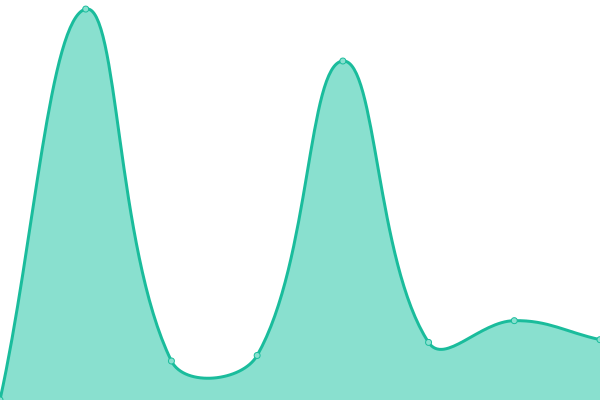
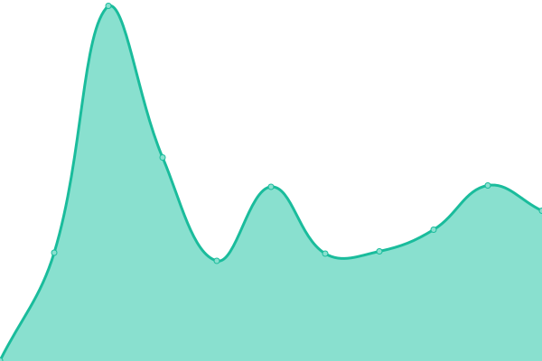

# [📈 Live Status](https://oneitsJosh.github.io/oneitsJosh): <!--live status--> **🟧 Partial outage**

This repository contains the open-source uptime monitor and status page for [oneitsJosh](https://oneitsJosh.github.io/oneitsJosh), powered by [Upptime](https://github.com/upptime/upptime).

With [Upptime](https://upptime.js.org), you can get your own unlimited and free uptime monitor and status page, powered entirely by a GitHub repository. We use [Issues](https://github.com/oneitsJosh/oneitsJosh/issues) as incident reports, [Actions](https://github.com/oneitsJosh/oneitsJosh/actions) as uptime monitors, and [Pages](https://oneitsJosh.github.io/oneitsJosh) for the status page.

<!--start: status pages-->
<!-- This summary is generated by Upptime (https://github.com/upptime/upptime) -->
<!-- Do not edit this manually, your changes will be overwritten -->
<!-- prettier-ignore -->
| URL | Status | History | Response Time | Uptime |
| --- | ------ | ------- | ------------- | ------ |
|  [One IT Support Ticket System](https://oneit.support) | 🟩 Up | [one-it-support-ticket-system.yml](https://github.com/oneitsJosh/oneitsJosh/commits/HEAD/history/one-it-support-ticket-system.yml) | 

 781ms
     
 | 

<a href="https://oneitsJosh.github.io/oneitsJosh/history/one-it-support-ticket-system">100.00%</a>
    

|  [KPS Ticket System](https://kpshelpdesk.oneit.support) | 🟩 Up | [kps-ticket-system.yml](https://github.com/oneitsJosh/oneitsJosh/commits/HEAD/history/kps-ticket-system.yml) | 

 704ms
     
 | 

<a href="https://oneitsJosh.github.io/oneitsJosh/history/kps-ticket-system">100.00%</a>
    

|  [Bowson](https://www.bowsonproperty.co.uk) | 🟩 Up | [bowson.yml](https://github.com/oneitsJosh/oneitsJosh/commits/HEAD/history/bowson.yml) | 

 1898ms
     
 | 

<a href="https://oneitsJosh.github.io/oneitsJosh/history/bowson">100.00%</a>
    

|  [Failed Test](https://iloveyourmama.com/) | 🟥 Down | [failed-test.yml](https://github.com/oneitsJosh/oneitsJosh/commits/HEAD/history/failed-test.yml) | 

 0ms
     
 | 

<a href="https://oneitsJosh.github.io/oneitsJosh/history/failed-test">100.00%</a>
    

|  [Failed Test 2](https://thisisafailedtestwebsite.com) | 🟥 Down | [failed-test-2.yml](https://github.com/oneitsJosh/oneitsJosh/commits/HEAD/history/failed-test-2.yml) | 

 0ms
     
 | 

<a href="https://oneitsJosh.github.io/oneitsJosh/history/failed-test-2">100.00%</a>
    

<!--end: status pages-->

[**Visit our status website →**](https://oneitsJosh.github.io/oneitsJosh)

## 📄 License

- Powered by: [Upptime](https://github.com/upptime/upptime)
- Code: [MIT](./LICENSE) © [oneitsJosh](https://oneitsJosh.github.io/oneitsJosh)
- Data in the `./history` directory: [Open Database License](https://opendatacommons.org/licenses/odbl/1-0/)
